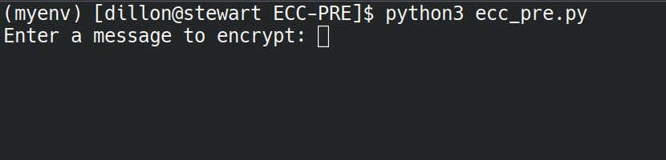
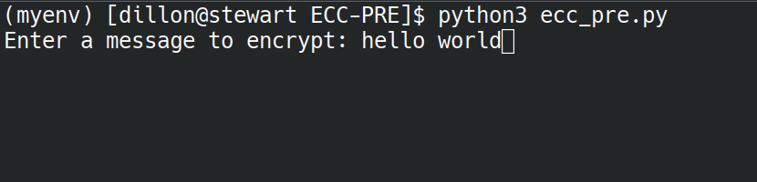
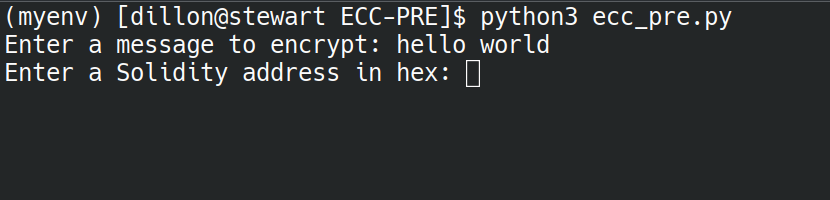
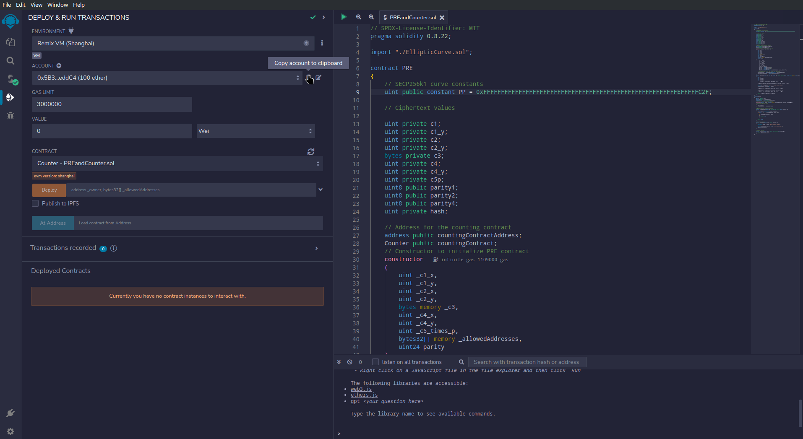
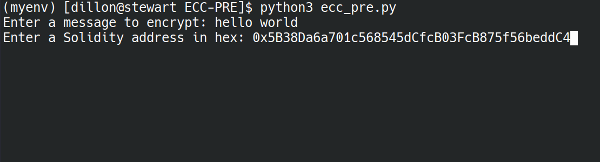
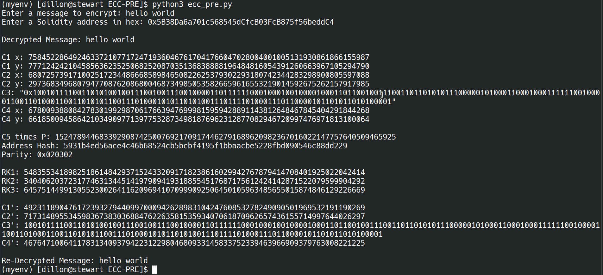
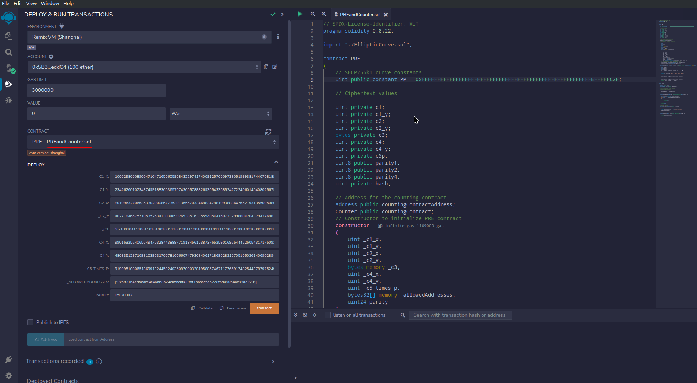
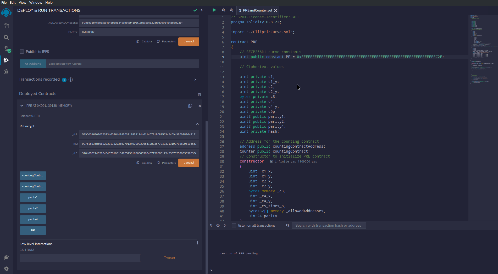
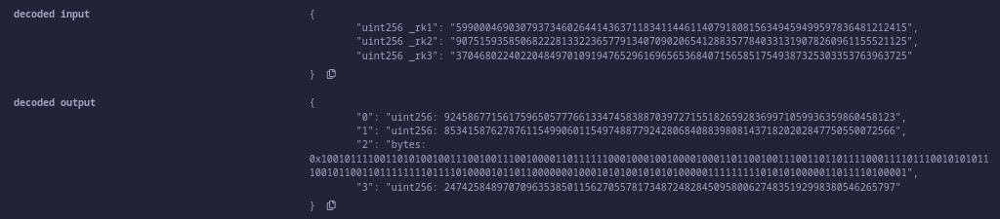
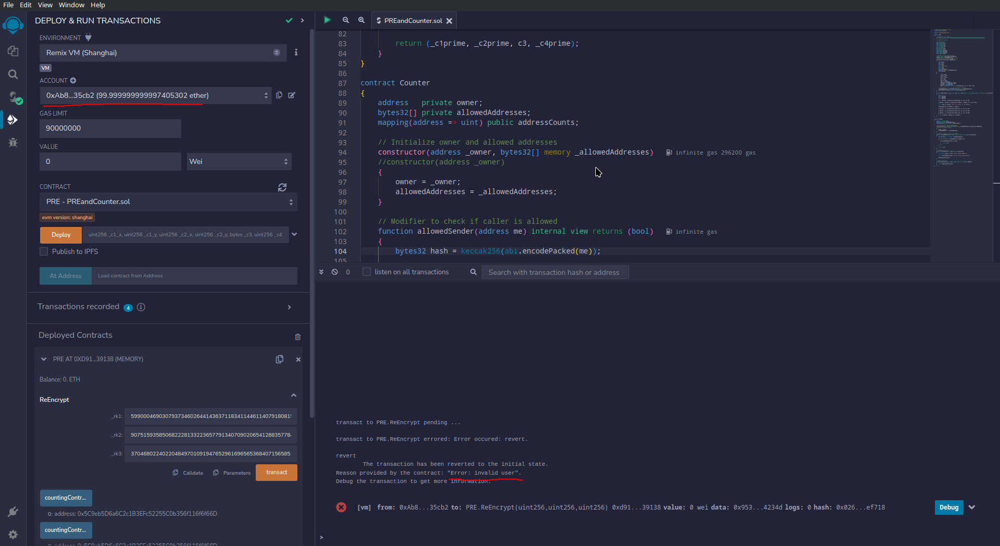

# Elliptic Curve Cryptography Proxy Re-Encryption

This code implements proxy re-encryption using elliptic curve cryptography in Solidity to ensure integrity and accuracy in tracking content downloads.

## Installation

This program can be installed using Git:

```bash
git clone https://github.com/DillonDavidson/ECC-PRE.git
cd ECC-PRE
```

I recommend using a Python virtual environment:

```bash
python3 -m venv myenv
source myenv/bin/activate
```

Then install the required packages:

```bash
pip install -r requirements.txt
```

## Smart Contract Overview
This program uses two smart contracts: PRE and Counter. The PRE contract performs the elliptic curve proxy re-encryption. The Counter contract holds the download count and only increments the count only when called by the PRE contract. 

## PRE Smart Contract

The PRE contract has 2 functions: the constructor and the re-encryption function.

### ***Constructor***

The PRE constructor takes 10 parameters:

1. **_C1_X** (`uint256`): The x-coordinate of the first ciphertext.
2. **_C1_Y** (`uint256`): The y-coordinate of the first ciphertext.
3. **_C2_X** (`uint256`): The x-coordinate of the second ciphertext.
4. **_C2_Y** (`uint256`): The y-coordinate of the second ciphertext.
5. **_C3** (`bytes`): The third ciphertext
6. **_C4_X** (`uint256`): The x-coordinate of the fourth ciphertext.
7. **_C4_Y** (`uint256`): The y-coordinate of the fourth ciphertext.
8. **_C5_TIMES_P** (`uint256`): The x-coordinate of the fifth ciphertext times the curve generator
9. **_ALLOWED_ADDRESSES** (`bytes32[]`): An array of hashed allowed account addresses. 
10. **_PARITY** (`uint24`): The 3 parities of ciphertext 1, ciphertext 2, and ciphertext 4 concatenated together.

The constructor sets the matching class variables, deploys the Counter contract, and saves the Counter contract's address.

### **Re-*Encrypt***

The **Re-Encrypt** function takes 3 parameters:

1. **RK1** (`uint256`): The first re-encryption key.
2. **RK2** (`uint256`): The second re-encryption key.
3. **RK3** (`uint256`): The third re-encryption key.

This function uses the re-encryption keys (if valid) to re-encrypt the ciphertexts. If successful, it calls the Increment function of the Counter contract. If the Increment function succeeds, it returns the re-encrypted ciphertexts.

The **Re-Encrypt** function returns 4 values:

1. **C1'** (`uint256`): The first re-encrypted ciphertext.
2. **C2'** (`uint256`): The second re-encrypted ciphertext.
3. **C3'** (`bytes`): The third re-encrypted ciphertext.
4. **C4'** (`uint256`): The fourth re-encrypted ciphertext.

## Counter Smart Contract

The Counter contract has 4 functions: the constructor, the allowedSender function, the increment function, and the getCount function.

### ***Constructor***

The Counter constructor takes 2 parameters:

1. **OWNER** (`address`): The owner of this contract (the PRE contract).
2. **ALLOWED_ADDRESSES** (`bytes32[]`): An array of the hashed addresses allowed to call the Increment function.

### ***AllowedSender***

The **AllowedSender** function takes 1 parameter:

1. **ME** (`address`): The address to be checked.

This function verifies whether the provided address is among the allowed senders.

The **AllowedSender** function returns 1 value:
1. **RESULT** (`bool`): The result of the check.

### ***Increment***

The **Increment** function takes 1 parameter:

1. **USER** (`address`): The user trying to increment the count.

If the address calling this function is the owner and the passed address is an allowed sender, then the count will be incremented.

### ***GetCount***

The **GetCount** function takes 1 parameter:

1. **User** (`address`): The user whose count is requested.

This function returns the count associated with the passed address if it exists.

The **GetCount** function returns 1 value:
1. **COUNT** (`uint256`): The passed user's count if it exists.

## Usage

I recommend using the [Remix IDE](https://remix.ethereum.org/) for testing the smart contracts. If you prefer a desktop version, there is an archived version available [here](https://github.com/ethereum/remix-desktop.git).

For testing purposes only, the ```ecc_pre.py``` program can be used to generate test values.

## Examples

Here is a simple walkthrough using the ```ecc_pre.py``` program to generate some values and the Remix IDE to test the smart contracts.

1. Run the Python program.


2. You will be prompted to enter a message, so enter one.


3. Then it will ask you for an address, so enter a valid one.


4. If you are using the Remix IDE, you can simply copy it by clicking this clipboard icon as shown.


5. Enter your valid address.


6. After entering both inputs, the program will encrypt, decrypt, re-encrypt, and re-decrypt your message.


7. Back in Remix, compile the contract and select the PRE contract (NOT the Counter contract!) from the **CONTRACT** drop down menu. Then enter the PRE constructor's parameters.


8. Press the orange **TRANSACT** button to deploy the contract. Then expand the contract in the **DEPLOYED CONTRACTS** section and enter the re-encryption keys and click the orange **TRANSACT** button just below it.


9. Comparing the output of the Python program and the smart contract, they are the same re-encrypted values.


10. If we change the address of the account in the **ACCOUNT** drop down menu to an address that we did not include, the Re-Encrypt function will fail to execute because this account is not allowed.


## Publications

TBA

## License

TBA
